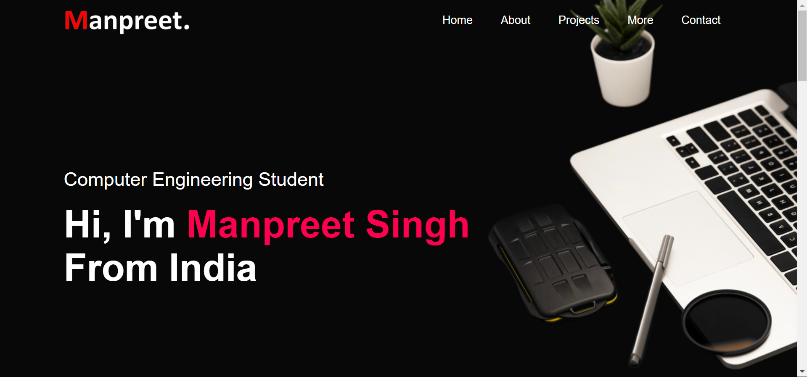

# Portfolio
 Welcome to my personal portfolio website! Here, I've crafted a dynamic and visually captivating platform using HTML, CSS, and JavaScript to showcase my skills, experiences, and projects. My primary goal with this project is to offer visitors an intuitive and professional experience while navigating through my work.

## Working of Project

### HTML File

The index.html file forms the foundation of our project, containing all essential HTML code that structures the website. It includes headers, paragraphs, buttons, and forms, creating the user interface. We integrate FontAwesome for icons, adding visual appeal and functionality. This file lays out the overall framework and organization of the frontend.

### CSS File

The styles.css file defines the visual styling of the project, specifying colors, font sizes, margins, and paddings. It includes animations and transitions to enhance the user experience. CSS ensures the website is aesthetically pleasing and responsive across different devices. This file is crucial for a polished, professional look.

### Images Directory 

The images directory stores all image assets used in the project, including icons, backgrounds, and logos. Organizing images here maintains a clean project structure and simplifies updates. These images enhance the visual narrative, providing context and improving user engagement. High-quality images significantly boost the website's aesthetic and usability.

## Working Screenshots of Project

### Main Home Page

### About Me

### Project Section

### More 

### Contact Page

## How to Run
To run the project, open the index.html file in any browser. It automatically launches on localhost, displaying the project.